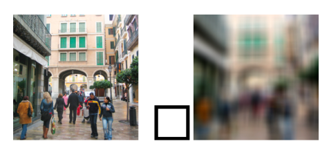

# Computer Vision OCR Pipeline implementacija

## Uvod

Ovaj dokument napisan je primarno kao izveštaj za projekat iz predmeta Kompjuterske vizije na Elektrotehničkom fakultetu, Univerziteta U beogradu.

Projekat predstavlja ručnu implementaciju pipeline-a za OCR detekciju registrarskih tablica, čija je struktura data na: https://www.geeksforgeeks.org/machine-learning/license-plate-recognition-with-opencv-and-tesseract-ocr/

## Cilj

Cilj projekta jeste da ručno implementira sve delove pipeline-a (do samog OCR poziva) date u priloženom blog postu, kao ilustraciju funkcionisanja konkretnih Computer Vision pristupa i algoritama. 

## Preduslovi za instalaciju

- Python IDE
- Git

## Struktura fajlova

Finalni izgled fajl sistema izgleda ovako:

```
root
|--- image_related_ops
    |--- load_image.py
    |--- grayscale.py
|--- contouring
    |--- detect_contours.py
|--- test_images
|--- main.py
|--- README.md
```

### Pojašnjenje:
- `image_related_ops`: Folder u kom su skripte koje vrše opšte operacije sa slikom.
    - `load_image.py`: Učitava sliku preko PIL-a.
    - `grayscale.py`: Konvertuje sliku u crno-beli prikaz.
`test_images`: Folder u kom se nalaze slike korišćene za primenu projekta.
- `main.py`: Početna tačka od koje kreće izvršavanje programa, iz kog se pozivaju sve funkcije.
- `README.md`: Uputstvo / izveštaj

## Instalacija i pokretanje

Klonirati projekat:

```
git clone https://github.com/fil-SK/CVOCR.git
```

Instalirati dependencies:

```
pip install -r requirements.txt
```

## Postupak rada

### 1. Učitavanje slike

Dva najčešća pristupa za učitavanje i rad sa slikama su:
- PIL (Pillow)
- OpenCV (cv2)

Iako je po pitanju performansi `cv2` bolji jer ima optimizovaniji C++ backend, `PIL` se koristi za manipulaciju slikama opšteg tipa, pa je zato odabran za potrebe ovog projekta.

---

### 2. Konverzija u crno-belo (grayscale)

Nakon učitavanja slike, prvi (stvarni) proces u pipeline-u je konverzija RGB slike u crno-belu. Ovakva konverzija čini sliku jednostavnijom za rad, prostorno je smanjujući (smanjuje broj kanala), što olakšava i ubrzava njeno dalje procesiranje.

<a href="./theory_and_implementation/2_grayscale.md">Teorija i implementacija</a>

---

### 3. Gausovo zamućivanje

#### 3.1. Zašto zamućivanje?
Crno-belo je uprostilo sliku, ali ovo možemo odvesti i korak dalje. Slika je i dalje s previše "detalja" - ivice automobila su jasne i oštre. Korišćenjem zamućivanja:
- uklanjamo noise - sitne detalje
- ne uništavamo glavne, bitne strukture - ivice

#### 3.2. Zašto Gausovo zamućivanje a ne "obično" (box blur)?

Kada posmatramo Box Blur, on funkcioniše tako što na nivou posmatranog prozora kernela računa srednju vrednost. Npr. za kernel 3x3, imamo 9 piksela, tako da će svi pikseli biti pomnoženi težinskim koeficijentom 1/9 - njihova piksel vrednost puta 1/9.
- Ovaj pristup nije najbolji, zato što nisu svi pikseli na slici jednaki. Neki su npr. bela pozadina dok su neki posmatrani objekat. Ne nosi svaki piksel jednaku količinu informacije.

Primena Box Blur-a može dovesti do "kockaste" slike:



#### 3.3. Gausovo zamućivanje

Gausovo zamućivanje je efikasnije i bolje u očuvanju ivica, a funkcioniše po principu da je svaki piksel težinski usrednjen prema svojim susednim pikselima.

<a href="./theory_and_implementation/3_gaussian_blur.md">Teorija i implementacija</a>

### 4. Keni algoritam za detekciju ivica

Keni algoritam (Canny Edge Detection algorithm) koristi se za detekciju različitih vrsta ivica na slikama. Konkretno, u primeni ovog projekta, iskoristićemo ga da detektujemo ivice tablica. Algoritam će, između ostalog detektovati i druge ivice, ali ćemo njegov output iskoristiti da, kasnije, iskoristimo ivice koje formiraju zatvorene konture (pravougaonik - tablica), odakle ćemo vršiti ekstrakciju teksta i OCR.

<a href="./theory_and_implementation/4_canny_alg.md">Teorija i implementacija</a>