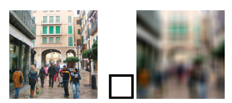
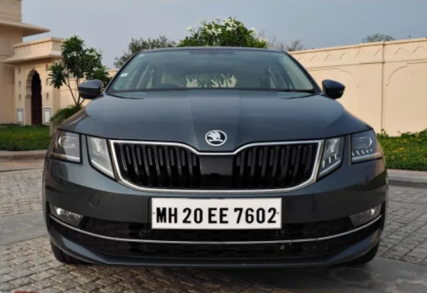
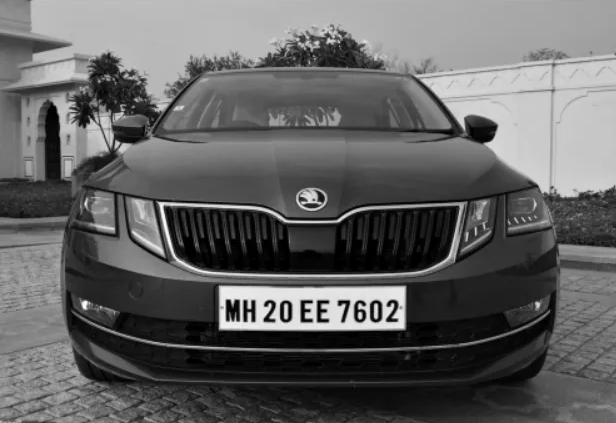
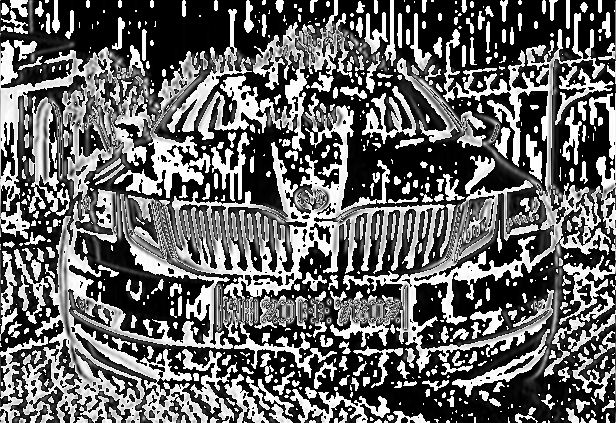
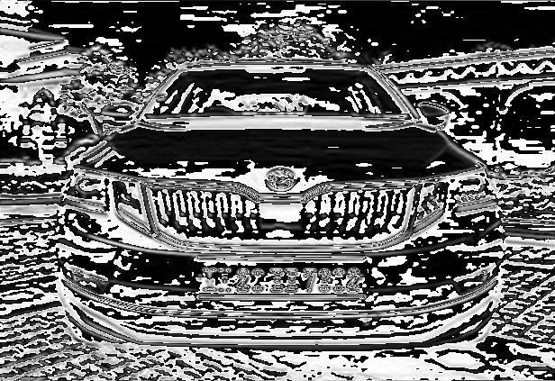
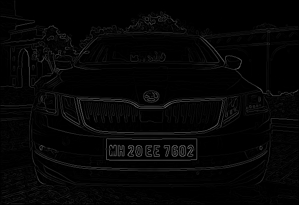
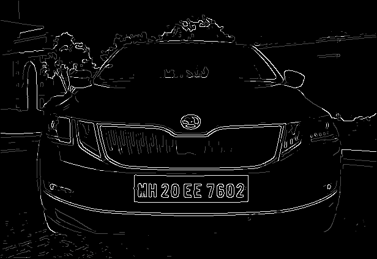
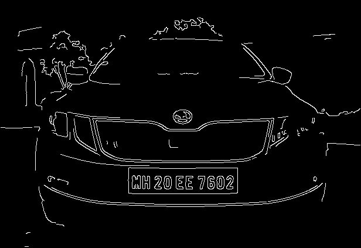
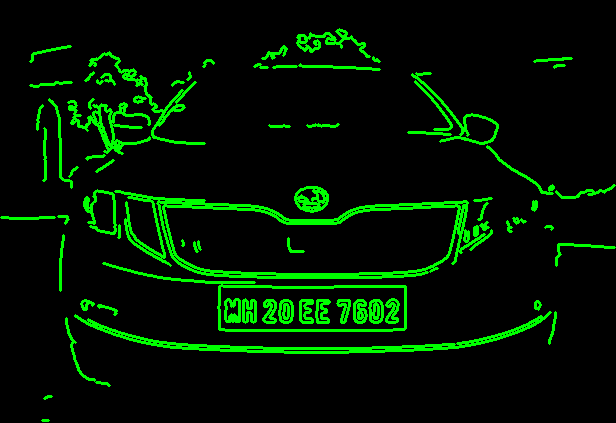
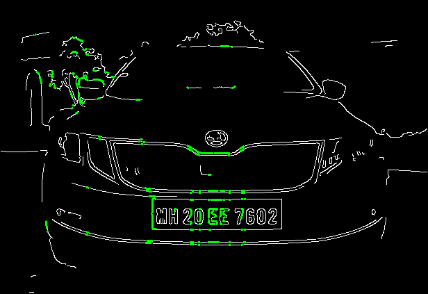

# Computer Vision OCR Pipeline implementacija

## Uvod

Ovaj dokument napisan je primarno kao izveštaj za projekat iz predmeta Kompjuterske vizije na Elektrotehničkom fakultetu, Univerziteta U beogradu.

Projekat predstavlja ručnu implementaciju pipeline-a za OCR detekciju registrarskih tablica, čija je struktura data na: https://www.geeksforgeeks.org/machine-learning/license-plate-recognition-with-opencv-and-tesseract-ocr/

## Cilj

Cilj projekta jeste da ručno implementira sve delove pipeline-a (do samog OCR poziva) date u priloženom blog postu, kao ilustraciju funkcionisanja konkretnih Computer Vision pristupa i algoritama. 

## Preduslovi za instalaciju

- Python IDE
- Git

## Struktura fajlova

Finalni izgled fajl sistema izgleda ovako:

```
root
|--- image_related_ops
    |--- load_image.py
    |--- grayscale.py
|--- contouring
    |--- detect_contours.py
|--- test_images
|--- main.py
|--- README.md
```

### Pojašnjenje:
- `image_related_ops`: Folder u kom su skripte koje vrše opšte operacije sa slikom.
    - `load_image.py`: Učitava sliku preko PIL-a.
    - `grayscale.py`: Konvertuje sliku u crno-beli prikaz.
`test_images`: Folder u kom se nalaze slike korišćene za primenu projekta.
- `main.py`: Početna tačka od koje kreće izvršavanje programa, iz kog se pozivaju sve funkcije.
- `README.md`: Uputstvo / izveštaj

## Instalacija i pokretanje

Klonirati projekat:

```
git clone https://github.com/fil-SK/CVOCR.git
```

Instalirati dependencies:

```
pip install -r requirements.txt
```

## Postupak rada

### 1. Učitavanje slike

Dva najčešća pristupa za učitavanje i rad sa slikama su:
- PIL (Pillow)
- OpenCV (cv2)

Iako je po pitanju performansi `cv2` bolji jer ima optimizovaniji C++ backend, `PIL` se koristi za manipulaciju slikama opšteg tipa, pa je zato odabran za potrebe ovog projekta.

---

### 2. Konverzija u crno-belo (grayscale)

Nakon učitavanja slike, prvi (stvarni) proces u pipeline-u je konverzija RGB slike u crno-belu. Ovakva konverzija čini sliku jednostavnijom za rad, prostorno je smanjujući (smanjuje broj kanala), što olakšava i ubrzava njeno dalje procesiranje.

<a href="./theory_and_implementation/2_grayscale.md">Teorija i implementacija</a>

---

### 3. Gausovo zamućivanje

#### 3.1. Zašto zamućivanje?
Crno-belo je uprostilo sliku, ali ovo možemo odvesti i korak dalje. Slika je i dalje s previše "detalja" - ivice automobila su jasne i oštre. Korišćenjem zamućivanja:
- uklanjamo noise - sitne detalje
- ne uništavamo glavne, bitne strukture - ivice

#### 3.2. Zašto Gausovo zamućivanje a ne "obično" (box blur)?

Kada posmatramo Box Blur, on funkcioniše tako što na nivou posmatranog prozora kernela računa srednju vrednost. Npr. za kernel 3x3, imamo 9 piksela, tako da će svi pikseli biti pomnoženi težinskim koeficijentom 1/9 - njihova piksel vrednost puta 1/9.
- Ovaj pristup nije najbolji, zato što nisu svi pikseli na slici jednaki. Neki su npr. bela pozadina dok su neki posmatrani objekat. Ne nosi svaki piksel jednaku količinu informacije.

Primena Box Blur-a može dovesti do "kockaste" slike:



#### 3.3. Gausovo zamućivanje

Gausovo zamućivanje je efikasnije i bolje u očuvanju ivica, a funkcioniše po principu da je svaki piksel težinski usrednjen prema svojim susednim pikselima.

<a href="./theory_and_implementation/3_gaussian_blur.md">Teorija i implementacija</a>

---

### 4. Keni algoritam za detekciju ivica

Keni algoritam (Canny Edge Detection algorithm) koristi se za detekciju različitih vrsta ivica na slikama. Konkretno, u primeni ovog projekta, iskoristićemo ga da detektujemo ivice tablica. Algoritam će, između ostalog detektovati i druge ivice, ali ćemo njegov output iskoristiti da, kasnije, iskoristimo ivice koje formiraju zatvorene konture (pravougaonik - tablica), odakle ćemo vršiti ekstrakciju teksta i OCR.

Keni algoritam sastoji se iz nekoliko faza:
- Redukcija smetnji, Gausovim zamućivanjem kernelom 5x5
- Izračunavanje intenziteta gradijenta slike: Konvolucija slike i Sobel kernela, izračunavanje snage (magnitude) i orijentacije gradijenta
- NMS: Ne-maksimalno potiskivanje: Ivice slike svodi na 1 piksel, umesto da se prostire na više piksela
- Tehnika dvostrukog praga: Izlaz NMS-a klasifikuje u jake i slabe piksele, a ostale potiskuje. Jaki se smatraju da pripadaju ivicama, dok slabi mogu a ne moraju pripadati ivici, već mogu biti smetnje.
- Histerezis: Finalna klasifikacija koja proverava da li su slabi pikseli deo ivice ili su smetnje.

<a href="./theory_and_implementation/4_canny_alg.md">Teorija i implementacija</a>

---

### 5. Pronalaženje kontura na slici

Keni algoritam dao je na svom izlazu sliku koja se sastoji isključivo od jakih piksela (255) i piksela vrednošću 0. Jake piksele sada treba analizirati i iz njih detektovati konture, jer ćemo dalje te konture razmatrati kao pravougaonike (registarske tablice) iz kojih ćemo izvlačiti registarske brojeve.

Ukratko, postupak se svodi na:

- Detekcija svih kontura: Idemo piksel po piksel i, ako je taj piksel jak, po DFS-u proveravamo sve njegove susede koji su neposećeni, sve dok ne dođemo do nekog posećenog piksela, čime zatvaramo konturu.
- Dodatno pojednostavljujemo detektovane konture - Bitni su nam samo ivični pikseli - oni koji formiraju konturu. Npr. za pravougaonik, bitni su nam samo ćoškovi, nisu nam bitni pikseli koji predstavljaju stranicu tj. ravnu liniju.

<a href="./theory_and_implementation/5_detect_contours.md">Teorija i implementacija</a>

---

### 6. Aproksimacija kontura

Iako smo prethodnim pojednostavljivanjem smanjili broj tačaka, ovo se može dodatno poboljšati, korišćenjem nekih od algoritama za aproksimaciju linija. Algoritam koji je, izvorno, korišćen u kodu, jeste Daglas-Pojkerov algoritam, pa se ovde razvija njegova ručna implementacija.
- Ovaj algoritam pojednostavljuje mnogougle oblike (konture), tako što uklanja koliko god tačaka je u mogućnosti, tako da se originalni oblik, suštinski, zadrži.

Za detaljnije informacije o implementaciji i algoritmu, pogledati: <a href="./theory_and_implementation/6_contour_approx_dp.md">Teorija i implementacija</a>

---

### 7. Nastavak

Budući da koraci 5 i 6 nisu ispunjeni u potpunosti (njihov rezultat nije mogao da se validira, jer na test primerima nisu bili ispravni), stalo se sa daljom ručnom implementacijom pipeline-a.

Suštinski, odrađen je većinski posao za samu funkcionalnost. Koraci koji su urađeni, a koji nisu u potpunosti ispravni, barem slikovito demonstriraju šta je to što je trebalo da se ispuni.

Do samog kraja, u radu, prikazan je originalni deo koda, radi pregleda pune funkcionalnosti.

---

## Rezultati

Testiramo funkcionalnosti na istoj slici koja je data i u originalnom radu. Nakon pokretanja koda, formiran je konzolni output, dat u `test_console_log.txt` fajlu.

Originalna slika:



Pretvaranje u grayscale:

 

Primena Gaussian Blur-a:

 

Primena Sobel kernela (x i y, respektivno):





Primena NMS-a:



Primena Double Threshold-a:



Nakon potpuno završenog Canny edge detection-a (u odnosu na poslednji korak, izvršen hysteresis):



Detekcija svih kontura:



Pokušaj običnog pojednostavljenja kontura:



Pokušaj pojednostavljenja kontura uz ugao tolerancije:


Nadalje, korišćen originalni izvorni kod iz priloženog blog posta.

Finalni rezultat OCR-a:

```
MH 20 EE 7602:
```