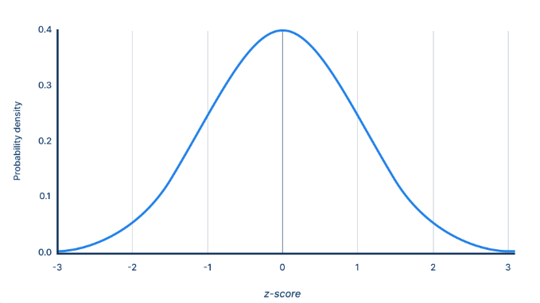
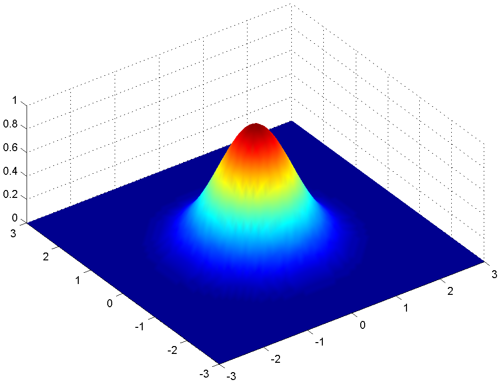
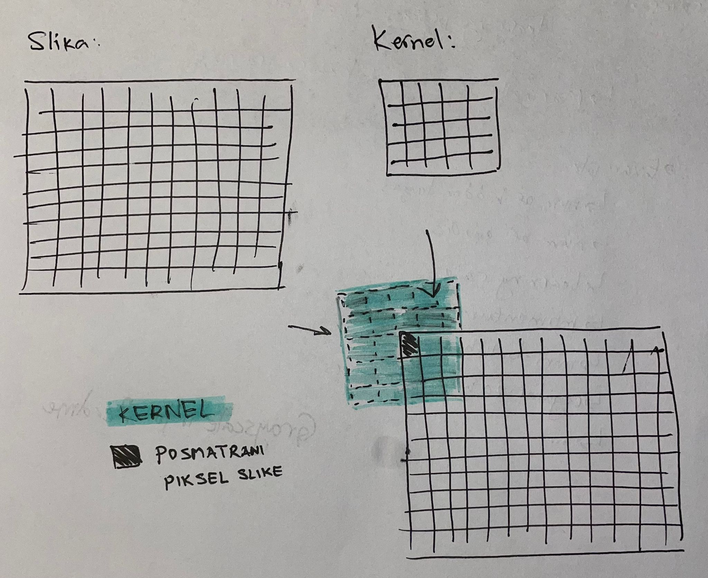
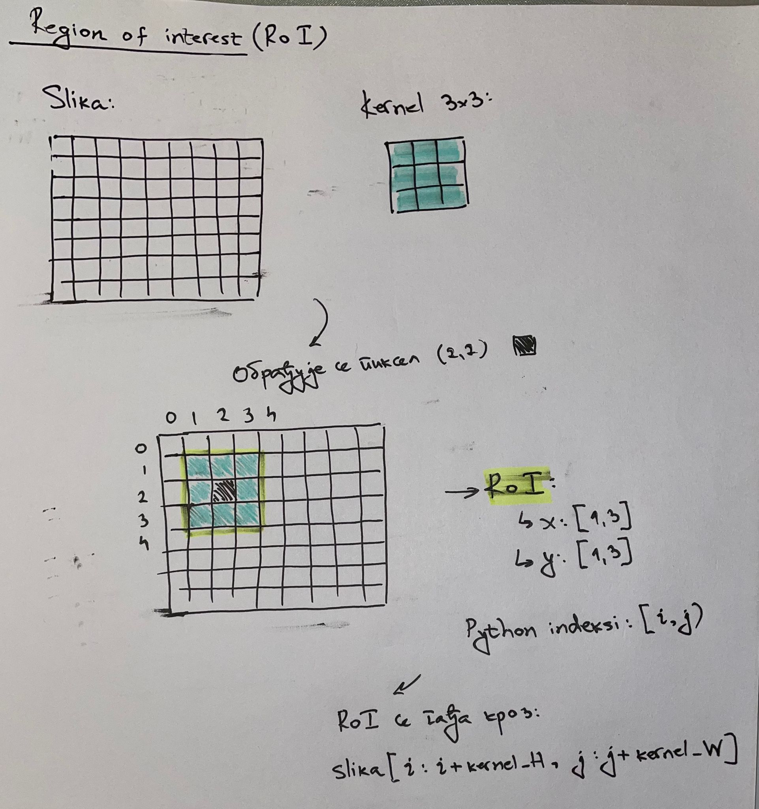

# Gausovo zamućivanje

## Ideja

Gausovo zamućivanje funkcioniše tako što svaki piksel dobija vrednost koja je težinski usrednjena vrednost njegovih susednih piksela (weighted average of its neighbors), i to tako da bliži pikseli imaju veću težinu. Time se postiže da slika "izgleda malo van fokusa", odnosno gradijentni prelaz u zamućenosti, umesto "blocky" zamućenosti običnog blur-a.

Gausovo zamućivanje koristi Gausovu formulu kao osnovu.

Ako posmatramo jednodimenzionalni prostor, se ova formula naziva normalna raspodela (distribucija), a alternativno zove se i Gausova raspodela, jer ju je Karl Fridrih Gaus prvi otkrio:



Slika izvor: https://www.scribbr.com/statistics/standard-normal-distribution/

Ova funkcija opisana je formulom:

$$
f(x) = \frac{1}{\sigma \sqrt{2\pi}} e^{-\frac{1}{2} {(\frac{x-\mu}{\sigma})}^2}
$$

Izvor: Normal distribution, Wikipedia članak: https://simple.wikipedia.org/wiki/Normal_distribution

Međutim, u radu sa slikama, zanima nas 2D Gausova formula:

$$
G(x,y)=\frac{1}{2 \pi \sigma^2}e^{- \frac{x^2 + y^2}{2 \sigma^2}}
$$

Ova formula oslikava površinu:



Slika izvor: https://commons.wikimedia.org/wiki/File:Gaussian_2d.png

Odavde, izdvajaju se sledeća svojstva:
- Visina površi: Osvetljenost (gustina verovatnoće)
- Koordinate x,y: Pozicija, udaljenost od centralnog piksela
- Sigma: Standardna devijacija, kontroliše jačinu zamućenja (blur strength)

## Implementacija

Za svaki piksel slike, potrebno je formirati kernel (Gausov kernel), odnosno matricu težina, koja je centrirana oko tog posmatranog piksela. Ovaj kernel odlučuje, u odnosu na posmatrani piksel, koliki uticaj njegovi susedni pikseli imaju na njega.

Gausovo zamućivanje realizuje se kao 2D konvolucija:
- Formira se kernel sa svojim težinama.
- Kernel se slide-uje kroz sliku, i izvršava sledeći proces:
    - Svaku kernel težinu pomnožiti sa odgovarajućom vrednošću piksela.
    - Sabrati rezultate.
    - Originalni piksel zameniti tim zbirom.


## OpenCV implementacija

Sada, bitan korak jeste određivanje veličine i vrednosti za Gausov kernel. Međutim, pošto ovaj projekat prati priloženi GeeksForGeeks članak, biće rekreirana linija:

```
cv2.GaussianBlur(gray, (5, 5), 0)
```

Samim tim, formiramo `5x5` kernel i `sigmaX=0` (standardna devijacija sigma u X smeru). Međutim, pošto sigma kontroliše količinu zamućenja, vrednost 0 značilo bi bez zamućenja. Zato, `sigmaX=0` u OpenCV označava da kod interno treba, na osnovu veličine kernela, da odredi vrednost sigme. Default vrednost za `sigmaY=0`, a u dokumentaciji je specificirano da, u slučaju `sigmaY=0`, tada se koristi `sigmaY=sigmaX`.

Formula koju OpenCV koristi za sigmu može se naći iz zvaničnog izvornog koda sa GitHub repoa: 

```
softdouble sigmaX = sigma > 0 ? softdouble(sigma) : mulAdd(softdouble(n), sd_0_15, sd_0_35);// softdouble(((n-1)*0.5 - 1)*0.3 + 0.8)
```

## Implementacija u projektu

### Padding



Kernel može da se poravna tako da gornji levi piksel kernela gađa gornji levi piksel slike. Međutim, to nije ono kako Gausov kernel treba da radi. Gausov kernel treba da u svom centru sadrži posmatrani piksel. Samim tim, ako se centar Gausovog kernela postavi na gornji levi piksel slike, kernel će "ispasti" iz okvira slike. Zato se slika mora proširiti paddingom.

### Region of Interest

Indeksi gađaju one delove slike koje pokriva kernel, kako bi moglo da se uradi množenje i sumacija:



Izvori:
- OpenCV GitHub repo: https://github.com/opencv/opencv/blob/4.x/modules/imgproc/src/smooth.dispatch.cpp#L152
- OpenCV GaussianBlur docs: https://docs.opencv.org/4.x/d4/d86/group__imgproc__filter.html#gae8bdcd9154ed5ca3cbc1766d960f45c1


Izvori:
- Gaussian Blur, Medium članak: https://medium.com/@prajun_t/gaussian-blur-cceb6c76a009
- OpenCV Python Gaussian Filtering, Kevin Wood | Robotics & AI YouTube snimak: https://www.youtube.com/watch?v=Ud5f1P1lr8Q
- Gaussian kernel: https://stackoverflow.com/questions/1696113/how-do-i-gaussian-blur-an-image-without-using-any-in-built-gaussian-functions
- Efficient Gaussian blur with linear sampling: https://www.rastergrid.com/blog/2010/09/efficient-gaussian-blur-with-linear-sampling/
- How is Gaussian Blur Implemented?: https://computergraphics.stackexchange.com/questions/39/how-is-gaussian-blur-implemented