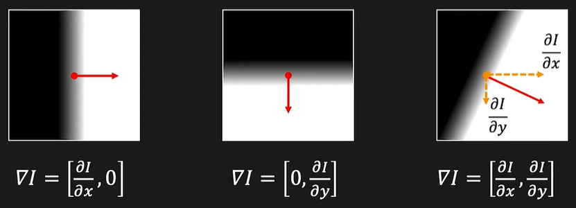
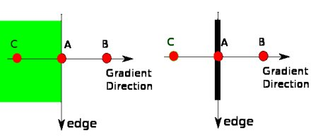
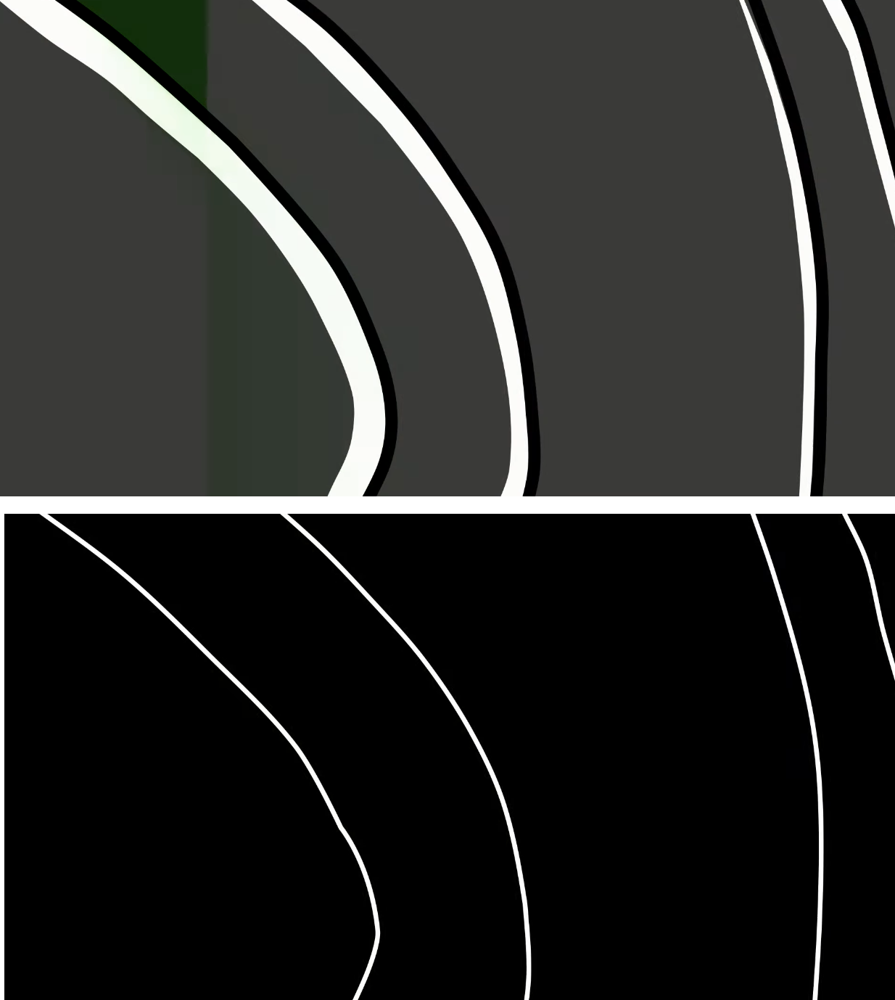
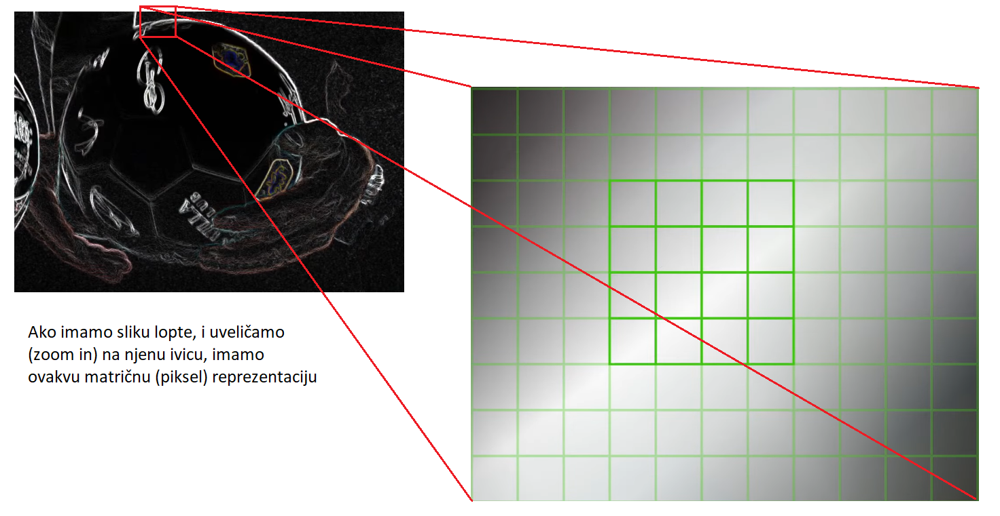
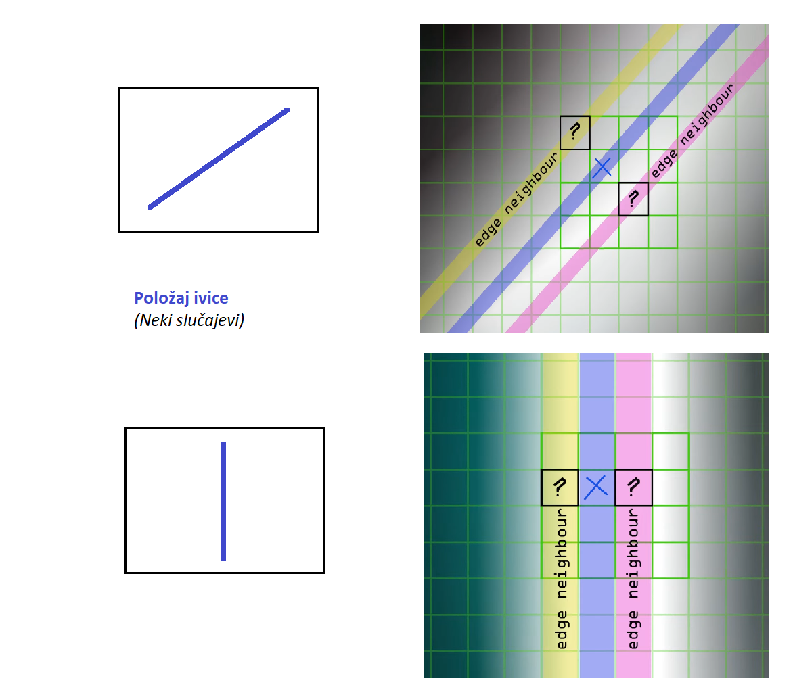
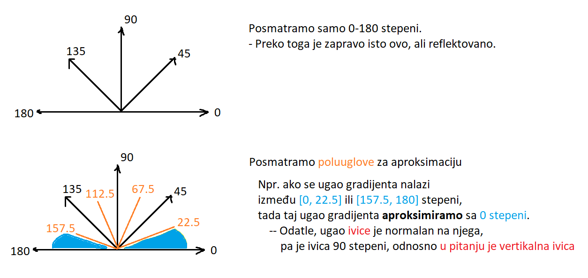

# Keni algoritam za detekciju ivica

## Detekcija ivica

Fantastičan uvod u ovo je Edge Detection Using Gradients | Edge Detection, First Principles of Computer Vision YouTube snimak: https://www.youtube.com/watch?v=lOEBsQodtEQ
- U nastavku dat je kratak pregled izloženog iz izvora.

### Šta je ivica?

Ivica je nagla promena intenziteta slike, na posmatranom malom regionu. Znamo da je izvod funkcije količina promene te funkcije. Tamo gde je funkcija konstantna, izvod će biti nula, dok se na promenama dobija neka vrednost izvoda. Lokalni ekstremumi funkcije označavaju ivice.
- Pozicija vrhova govori nam gde se ivica nalazi.
- Vrednost vrha govori nam koja je jačina ivice.


Izvor slike: *Edge Detection Using Gradients | Edge Detection, First Principles of Computer Vision YouTube snimak: https://www.youtube.com/watch?v=lOEBsQodtEQ*

U slučaju 2D slike, parcijalnim izvodima možemo da odredimo promenu intenziteta, po konkretnoj dimenziji. Za te potrebe koristimo operator gradijenta. Gradijent slike, po njenim koordinatama x i y, jeste parcijalni izvod slike po te dve promenljive:

$$
\nabla Slika=[\frac{\partial Slika}{\partial x}, \frac{\partial Slika}{\partial y}]
$$

U zavisnosti od konkretnog tipa ivice, možemo da imamo različite vrednosti gradijenta:



Koristeći ova dva parcijalna izvoda, po promenljivama, odnosno širini i visini, možemo da dobijemo dva krucijalna podatka:

**Snagu (jačinu) ivice - Gradient Magnitude**:

$$
Snaga = \left\| \nabla Slika \right\| = \sqrt{(\frac{\partial Slika}{\partial x})^2 + (\frac{\partial Slika}{\partial y})^2}
$$

**Orijentaciju ivice**:

$$
Orijentacija = arctg(\frac{\partial Slika}{\partial x} / \frac{\partial Slika}{\partial y})
$$

Parcijalni izvodi mogu se implementirati preko konvolucije, uz pažljivo odabrane vrednosti kernela. Detaljnije o ovome u priloženom izvoru. Kao primena u Keni algoritmu, koristiće se Sobel operator koji, za x i y vrednosti, ima različite kernele:

$$
Sobel_X = \left[
\begin{matrix}
-1 & 0 & 1 \\
-2 & 0 & 2 \\
-1 & 0 & 1 \\
\end{matrix}
\right]
$$

$$
Sobel_Y = \left[
\begin{matrix}
1 & 2 & 1 \\
0 & 0 & 0 \\
-1 & -2 & -1 \\
\end{matrix}
\right]
$$

Napomena: U kodu su korišćene vrednosti matrica sa invertovanim prvim i trećim redom. Intuitivnija, ali jako primitivna, analiza: [Invertovani redovi analiza](./4_5_inverted_rows_explanation.md)
- *Wikipedia: "He also assumed the vertical axis increasing upwards instead of downwards as is common in image processing nowadays, and hence the vertical kernel is flipped."*
- Izvor: https://en.wikipedia.org/wiki/Sobel_operator#Formulation

## Implementacija

Želimo da implementiramo OpenCV implementaciju:

```
edges = cv2.Canny(blurred, 100, 200)
```

Prema [Canny OpenCV dokumentaciji](https://docs.opencv.org/4.x/da/d22/tutorial_py_canny.html), ova funkcija realizovana je kroz sledeće korake:
- 1. Redukcija smetnji (Noise reduction): Gaussian Blur sa 5x5 kernelom
- 2. Izračunavanje intenziteta gradijenta slike
- 3. Non-Maximum Suppression
- 3.5. U određenim resursima (npr. [Wikipedia](https://en.wikipedia.org/wiki/Canny_edge_detector#Double_threshold)) postoji međukorak između NMS-a i histerezisa, gde se vrši Double Tresholding.
- 4. Hysteresis Thresholding

### Implementacija: Redukcija smetnji

Ovaj korak je već ispunjen, budući da kao input u našoj Keni implementaciji imamo sliku na kojoj je primenjeno Gausovo zamućivanje.

### Implementacija: Izračunavanje intenziteta gradijenta slike

Svaki piksel ima svoje x i y komponente. Kao što je rečeno u uvodu, da bismo došli do ovog dela, neophodno je da imamo parcijalne izvode po x i y. Za to:
- Formiramo Sobel kernele.
- Vršimo konvoluciju sa input Gaussian blur slikom, i konkretnim Sobel kernelom, za x i y. Konvolucija je standardno ručno implementirana.

Konvolviranjem sa X Sobelovim kernelom, dobijamo koliko se intenzitet menja horizontalno, odnosno konvolviranjem sa Y Sobelovim kernelom koliko se intenzitet menja vertikalno.

#### Šta je snaga gradijenta?

Ako je rezultujuća matrica `convolved_img_x`, tada, ako $\left| convolved\_img\_x \right|$ ima veliku vrednost, to znači da postoji veća razlika između "levih i desnih" piksela, odnosno postoji istaknuta **vertikalna ivica**. Analogno, za `convolved_img_y`, ako $\left| convolved\_img\_y \right|$ ima veliku vrednost,  to znači da postoji veća razlika između "gornjih i donjih" piksela, odnosno postoji istaknuta **horizontalna ivica**.
- To je **magnituda**, tj. **snaga**: koliko je nagla promena u osvetljenosti piksela (tj. pikselove numeričke vrednosti - veća vrednost, "svetliji" piksel, tj. bliži beloj boji, odnosno max uint8 vrednosti 255).
- Velika magnituda: Jaka, istaknuta ivica. Samim tim, nagli prelaz između piksela.
- Mala magnituda: Slaba ivica, blag prelaz između piksela.

#### Šta je orijentacija?

Orijentaciju treba posmatrati u odnosu na ŠTA se odnosi. Orijentacija se dobija kao arkus-tangens `convolved_img_y` i `convolved_img_x`. Samim tim, to je orijentacija **gradijenta**.
- Orijentacija gradijenta govori nam u kom smeru se nalazi najveća promena intenziteta.
- ALI, SAMA IVICA nalazi se normalno na taj pravac.

Vizuelno se to može bolje zamisliti, sa OpenCV docs slike:




### Implementacija: NMS - Ne-maksimalno potiskivanje

Nakon konvolucije sa Sobel kernelima, dobili smo output (sliku) koja nam govori o intenzitetu promene osvetljenosti piksela.
- Na toj granici, recimo između skroz crnog i skroz belog piksela, ta granica, tj. ta promena, ne ogleda se u jednom konkretnom pikselu, već u više susednih piksela.

Ovo je problem. Nas zanima gde se nalazi ivica, nije nam potrebna "debela linija" od nekoliko piksela koji će reći "ivica je ovde negde".

#### Zašto je debljina ivice problem?

Ivica nam, obično, nikad nije finalni cilj. Ivica je jedan od međukoraka za dalju obradu (za detekciju nekih kontura, krugova, tablica u našem slučaju).
- Šta god da je obrada, potrebna nam je **precizna lokacija** takve ivice, a ne "debela linija" koja kaže da je "ivica tu negde". Koji piksel je u tom slučaju ivica? Ta neodređenost može da napravi problem u kasnijoj obradi.

#### NMS kao rešenje

NMS (Non-Maximum Suppression) se koristi kao rešenje ovog problema. Više piksela koji su "grupisani oko ivice" hoćemo da proredimo tako da **ivica bude formirana od 1px**.



*Slika iznad: pre NMS; Slika ispod: nakon NMS; Izvor slike: Canny Edge Detection, Computerphile, YouTube snimak*

Izvor: Canny Edge Detection, Computerphile, YouTube snimak: https://www.youtube.com/watch?v=sRFM5IEqR2w&t

#### Kako NMS radi

NMS radi tako što, za svaki piksel, posmatra da li je njegova vrednost lokalni maksimum, odnosno da li je posmatrani piksel s većom vrednošću od njegovih suseda.
- Ovde je bitno da su nam bitni susedni pikseli koji su "pored" ivice, a ne NA ivici.
- "Na ivici" bi označavalo zapravo tu ivicu, nije nam bitno da li je ono što već znamo da je ivica dominantno ili ne. Hoćemo da tu ivicu stanjimo, tako da želimo da njene bordere učinimo manjim - zato nas zanimaju pikseli oko ivice.

Ako imamo ovakvu situaciju:



Tada, u slučaju ovakvih ivica, nas zanimaju **ovi susedi**:



- U kodu, ti susedi su označeni kao `pixel_ahead` i `pixel_before`, kao pozicioni u odnosu na posmatrani piksel.

Kada, po ovom pristupu, analiziramo svaki piksel, da li je on lokalni maksimum, primenjeno na celu sliku, ovo će rezultovati tankim linijama koje predstavljaju ivice.

##### Korak 1: Određivanje orijentacije ivice na osnovu orijentacije gradijenta

Imamo ugao gradijenta, u radijanima, koji ćemo iskoristiti da odredimo ugao ivice.
- Radi intuitivnijeg i lakšeg rada, radijane prebacujemo u stepene.

Dalje, vršimo aproksimaciju. Nije nam cilj da odredimo tačan ugao u stepen, već da okvirno znamo gde se ivica nalazi, kako bismo mogli da je procesuiramo. Znamo da se ivica nalazi normalno u odnosu an ugao gradijenta. Ugao gradijenta aproksimiramo na bliži ugao, određujemo normalni na njega i odatle dobijamo koji je tip ivice:



Mapiranje aproksimacije uglova i ivica je:

| Aproks. ugao [stepeni] | Opseg [stepeni] | Ivica |
| ------------ | ----- | ----- |
| 0 | 0 - 22.5 i 157.5 - 180 | Vertikalna |
| 45 | 22.5 - 67.5 | Dijagonala \ |
| 90 | 67.5 - 112.5 | Horizontalna |
| 135 | 112.5 - 157.5 | Druga dijagonala / |

##### Korak 2: Zadržavanje ili potiskivanje vrednosti piksela

Na kraju, proveravamo da li je trenutni piksel lokalni maksimum između svojih relevantnih suseda, odnosno između `pixel_before` i `pixel_after` suseda. Ako jeste, onda ga zadržavamo, a ako nije, potiskujemo ga (supression - postavljamo na 0).

### Implementacija: Double Threshold

Tehnika dvostrukog praga u nekim izvorima izdvojena je kao zasebna, dok je u OpenCV implementaciji integrisana u Hysteresis Threshold korak.

Uprošćeno, tehnika dvostrukog praga (iako zvuči kao kineska borilačka veština) zapravo predstavlja klasifikaciju preostalih piksela nakon NMS-a.
- Nakon NMS-a preostali su samo oni pikseli koji su lokalni maksimum. Oni koji to nisu, potisnuti su - imaju vrednost 0.
- Međutim, to što je neki piksel lokalni maksimum ne mora nužno da znači da je on istovremeno i nešto što nam je bitno.

U ovom trenutku, od preostalih piksela, možemo da imamo:
- stvarni, korisni piksel, koji predstavlja neki deo ivice
- ne koristan piksel koji predstavlja smenju (noise) - bio je dovoljno "jak" da preživi NMS, ali fundamentalno ne predstavlja ono što nama treba

Tehnika dvostrukog praga vrši klasifikaciju piksela, prema ove dve kategorije, i to radi, kao što joj ime kaže, koristeći dve prag (threshold) vrednosti, date kao argument:
- `low_threshold`: Niži prag. Pikseli koji imaju vrednost nižu od ovog praga smatraju se smetnjama i potiskuju se.
- `high_threshold`: Viši prag. Pikseli koji imaju vrednost veću ili jednaku ovoj smatraju se relevantnim podatkom koji pripada ivici.
- Vrednost piksela može biti i između ova dva praga. U tom slučaju njegovo stanje je neodređeno - može biti i smetnja ali i deo ivice. Tada se zadržava.

U kodu se definišu dve konstante:
- `STRONG_EDGE_UINT8_VALUE = 255`
- `WEAK_EDGE_UINT8_VALUE = 80`

Kada se vrši klasifikacija obrađivanog piksela:
- Ako je preko `high_threshold`: Dodeljujemo mu vrednost `STRONG_EDGE_UINT8_VALUE`.
- Ako je preko `low_threshold` a ispod `high_threshold`: Dodeljujemo mu vrednost `WEAK_EDGE_UINT8_VALUE`.

Na taj način postigli smo da pikseli imaju "jednaku jačinu", odnosno da se ne oslanjamo na njihove vrednosti, već, "jak piksel" koji predstavlja ivicu ima MAX vrednost, dok "slab piksel" ima neku srednju vrednost.
- Vrednosti konstanti uzete su kao standarne vrednosti boja: 255 je bela, dok je 80 obično uzimana vrednost za sivu (srednja vrednost između bele, koja je najviša vrednost, i crne koja je najniža vrednost).

Izvor: OpenCV docs: 

U određ

TODO objašnjenje, kroz ove izvore što sam video

Za double threshold:
After application of non-maximum suppression, the remaining edge pixels provide a more accurate representation of real edges in an image. However, some edge pixels remain that are caused by noise and color variation. To account for these spurious responses, it is essential to filter out edge pixels with a weak gradient value and preserve edge pixels with a high gradient value

After you compute:

Gradient magnitude (how strong the edge is), and

Non-Maximum Suppression (to thin it to one pixel wide),

you end up with an image where strong edges have high magnitudes, and weak edges or noise have low magnitudes.

| Category         | Range                           | Interpretation                    |
| ---------------- | ------------------------------- | --------------------------------- |
| **Strong edges** | `G >= high_thresh`              | Confidently part of an edge       |
| **Weak edges**   | `low_thresh <= G < high_thresh` | Maybe an edge, needs confirmation |
| **Non-edges**    | `G < low_thresh`                | Definitely noise, discard         |


## Izvori

- Edge Detection Using Gradients | Edge Detection, First Principles of Computer Vision YouTube snimak: https://www.youtube.com/watch?v=lOEBsQodtEQ
- Sobel operator, Wikipedia članak: https://en.wikipedia.org/wiki/Sobel_operator
- Canny Edge Detector | Edge Detection, First Principles of Computer Vision YouTube snimak: https://www.youtube.com/watch?v=hUC1uoigH6s
- Canny Edge Detector, Wikipedia članak: https://en.wikipedia.org/wiki/Canny_edge_detector
  - Dobar izvor za korake koje treba sprovesti
- RO-1.0X104: Non-Maximal Suppression in Canny Edge Detection Algorithm, Deep Eigen, YouTube snimak: https://www.youtube.com/watch?v=9cpTmJCsI0M