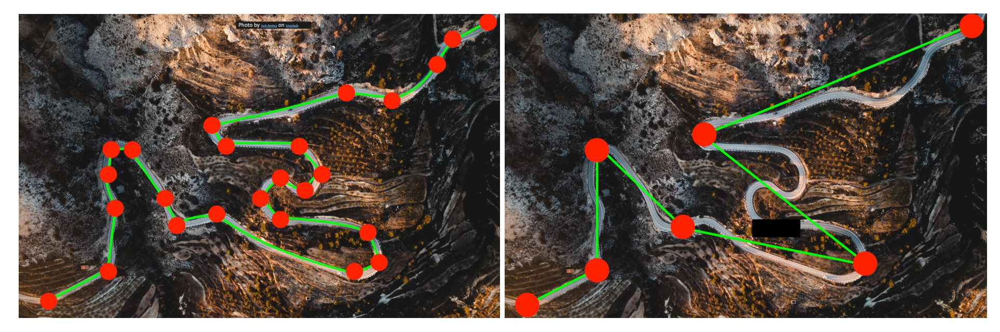
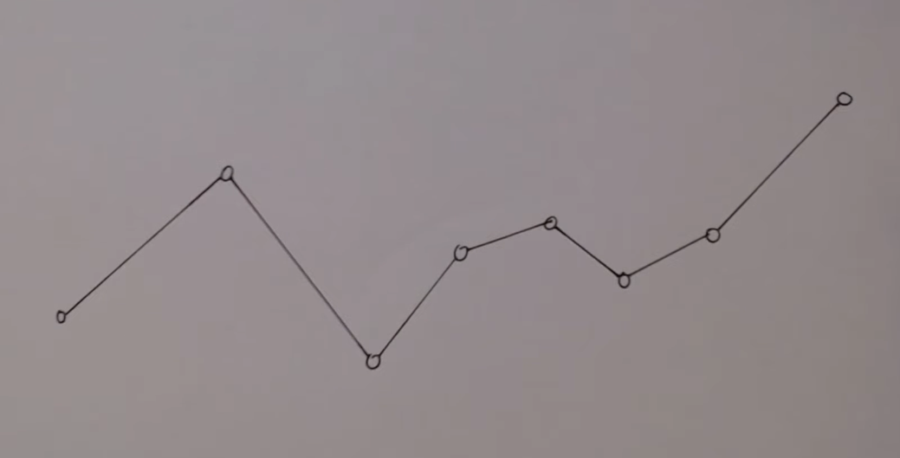
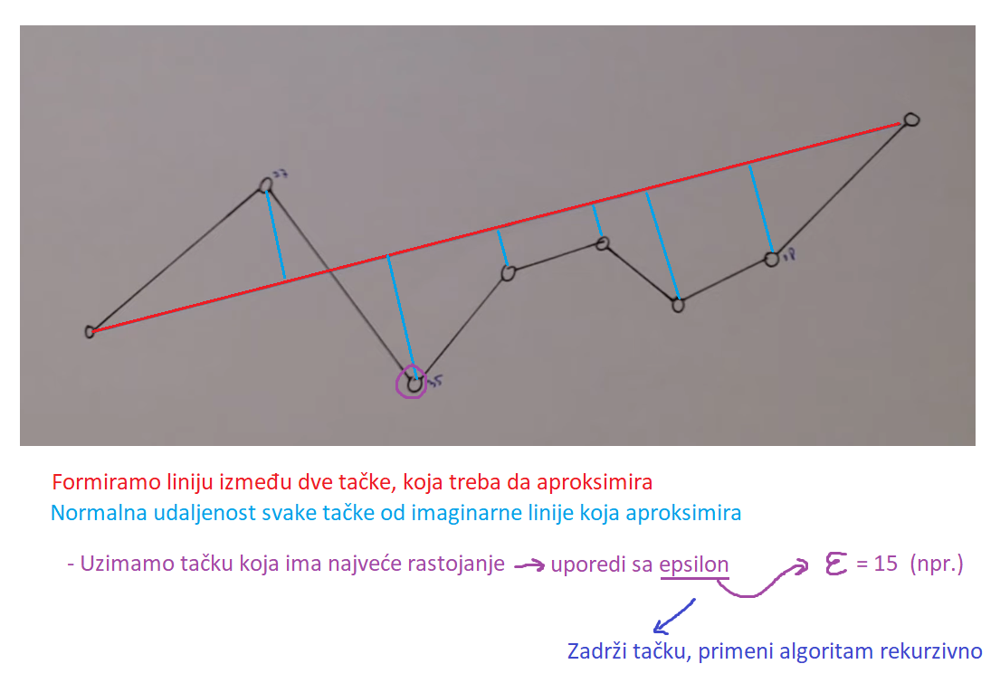
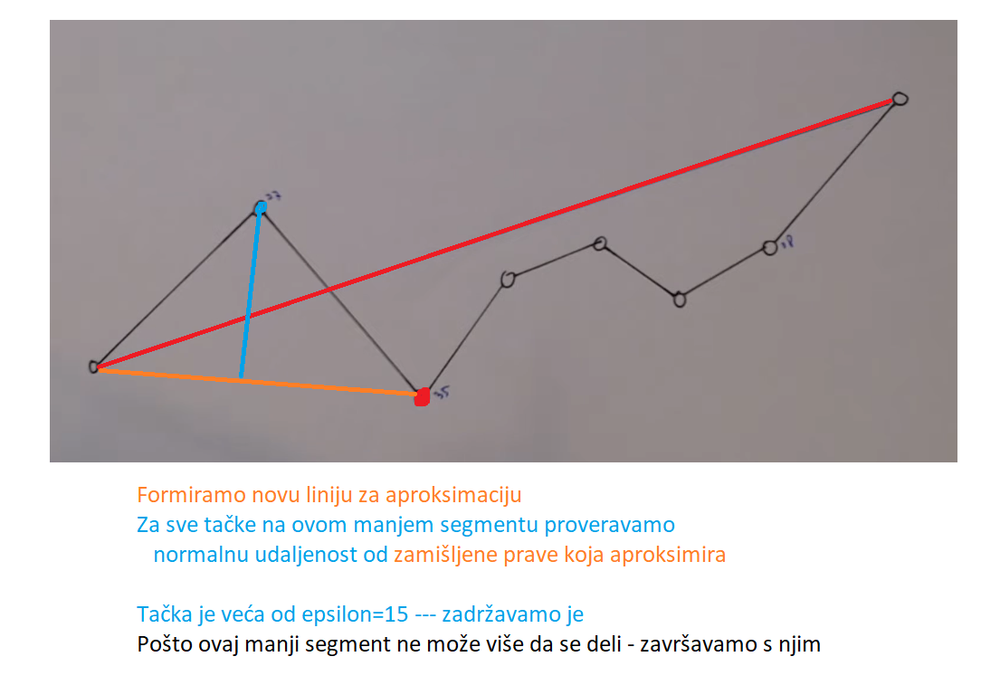
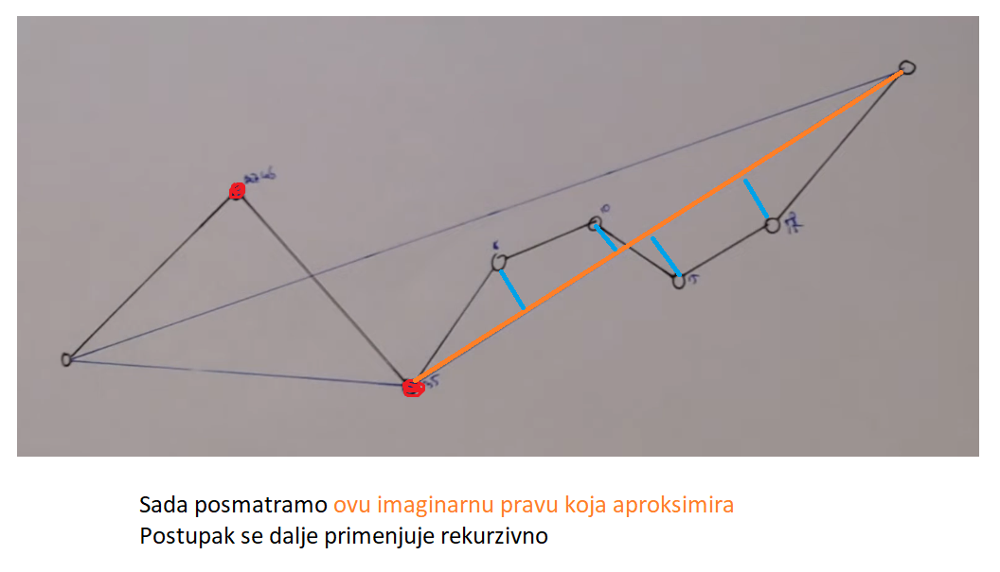
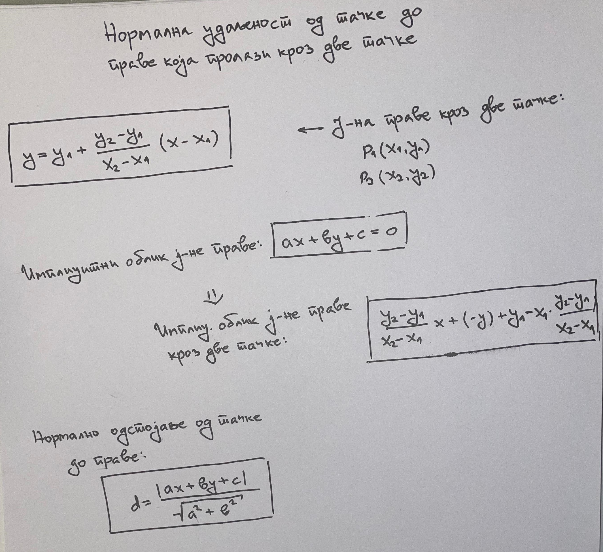

# Aproksimacija konture na mnogougao - DP algoritam

## Zašto je DP algoritam potreban?

Zamislimo da obrađujemo neku putanju, koja se sastoji iz puno tačaka. Nama, fundamentalno, nisu sve tačke neophodne. Dovoljno nam je da znamo približni oblik putanje, koja aproksimira originalnu putanju, a da na taj način u velikoj meri smanjimo količinu tačaka koju treba da obradimo.

Primer: (slika levo - originalna putanja; slika desno - nakon DP algoritma)



*Izvor: Ramer Douglas Peucker - Director's Cut, cometmace, YouTube snimak: https://www.youtube.com/watch?v=M0J_yq49Go8&t*

Ovu logiku primenjujemo i na naš slučaj sa tablicom. Možda radimo sa konturama koje su "čudno" predstavljene na originalnoj slici. Te tačke aproksimiramo sa manje tačaka koje će predstavljati pravougaonik.

## Kako DP algoritam radi?

Daglas-Pojkerov algoritam (Douglas-Peucker) aproksimira linije mnogougla tako što iz njih uklanja što je više tačaka moguće, ali tako da zadrži osnovni oblik posmatranog mnogougla.

Algoritam kao svoj ulaz prihvata:

- Konture koje treba da obradi
- $\epsilon$ vrednost koja predstavlja toleranciju: Maksimalna normalna udaljenost od posmatrane tačke do zamišljene linije koja će služiti kao aproksimacija.

Postupak:

- Povučemo liniju između dve najdalje tačke. Ta linija predstavlja aproksimaciju čitave putanje.
- Izračunamo normalno rastojanje svake od tački, u odnosu na tu pravu koju smo upravo formirali.
- Za dobijena rastojanja, proveravamo da li su ona manja ili veća (ili jednaka) od tolerancije $\epsilon$
    - Rastojanje < $\epsilon$: To znači da prava na tom segmentu dobro aproksimira, pa tu tačku možemo da zanemarimo - **uklonimo**.
    - Rastojanje >= $\epsilon$: Prava na tom segmentu nije dobra aproksimacija te tačke, ta tačka mora da se **zadrži**.
- Tačke koje smo zadržali su **bitne**. Na tim bitnim tačkama delimo putanju i algoritam primenjujemo rekurzivno po istom principu.

Efektivno, hoćemo da povlačimo linije koje će aproksimirati putanje i onda proveravamo da li tačke koje postoje upadaju u toleranciju udaljenosti $\epsilon$ koju dajemo kao argument.
- Manje od $\epsilon$: Super, ukloni tačku, prava je dobra aproksimacija.
- Veće ili jednako $\epsilon$: Tačka je bitna, mora da se zadrži. Hoćemo da aproksimiramo dalje, pa ovde podeli trenutnu putanju i ponovi algoritam rekurzivno, da bi napravio manju aproksimaciju na tom izdeljenom segmentu.

### Slikovit prikaz rada algoritma









Izvor: Algorithms: Ramer-Douglas-Peucker Explained, Derick Rethans, YouTube snimak: https://www.youtube.com/watch?v=SbVXh5VtxKw
- Odlično pojašnjava funkcionisanje algoritma

## Implementacija

- Algoritam ima wrapper funkciju koja prvo izračunava epsilon vrednost koju će koristiti, a zatim za svaku konturu poziva implementaciju DP algoritma.

U originalnom kodu koristi se:

```python
epsilon = 0.02 * cv2.arcLength(contour, True)
```

pa je odatle iskorišćeno da se epsilon formira kao `0.02` pomnoženo dužinom te konture (zbirom udaljenosti svih tačaka u konturi).

Daglas-Pojkerov algoritam implementiran je onako kako je i objašnjen iznad:
- Poveže dve tačke.
- Odredi normalno rastojanje svih tačaka na tom segmentu u odnosu na formiranu pravu.
- Pronađe se tačka sa najvećim rastojanjem.
- Za tu tačku, gleda se da li je ispod ili preko epsilon.
    - Ako je ispod, uklanja se.
    - Ako je preko, zadržava se, region se deli na podregion od početka pa do te tačke, i algoritam se ponavlja dalje, dok se sve tačke ne obrade.

### Formula za normalno rastojanje

Izvodi se iz dve formule:

- Jednačina prave kroz dve tačke, data u implicitnom obliku
- Normalna udaljenost tačke od prave

Izvođenje formule je dato ispod:



